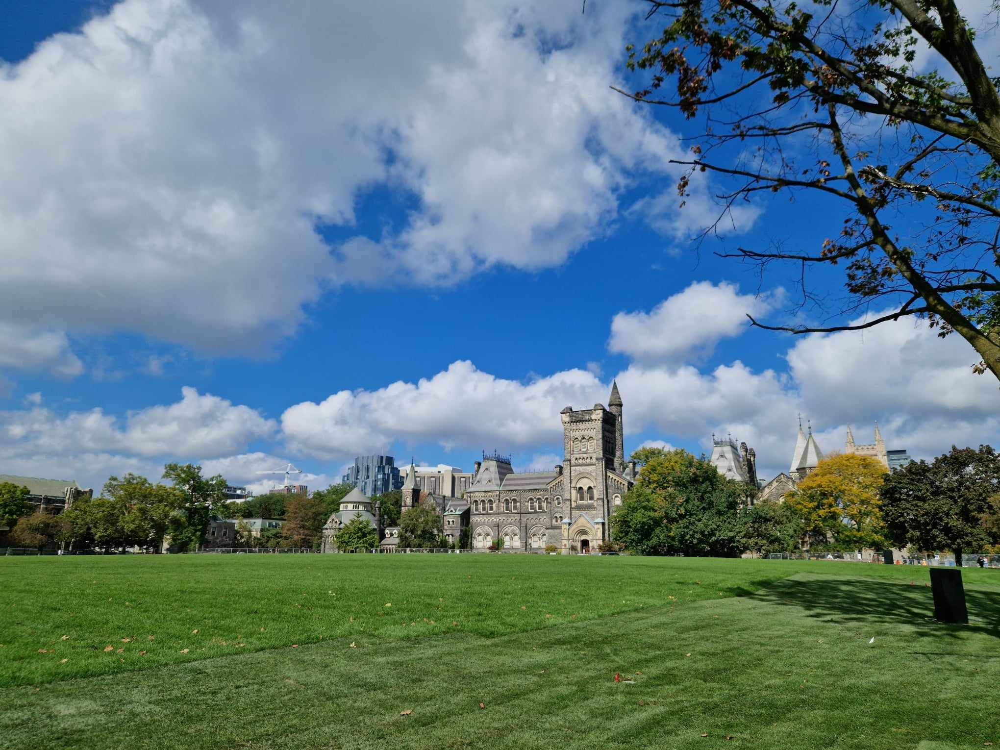
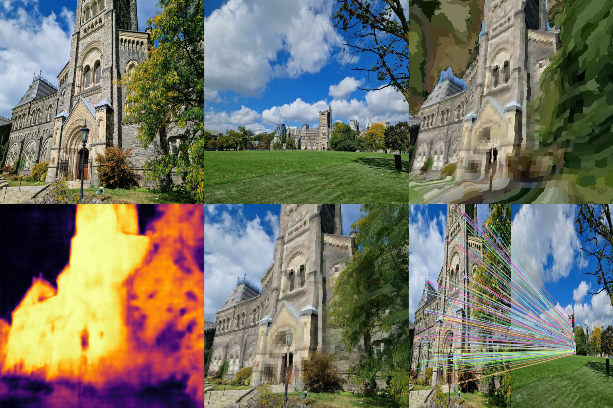

# RoMa v2 — ONNX & Triton Deployment

Export, validate, and serve the [RoMa v2](https://github.com/Parskatt/RoMa) dense image matcher as an ONNX model, with full support for local inference and NVIDIA Triton Inference Server deployment.

RoMa v2 produces a **dense warp** and **overlap confidence map** between any two images — useful for visual localization, 3D reconstruction, and image alignment.

---

## Example results

Input images (University of Toronto, large viewpoint change):

| Image A | Image B |
|---------|---------|
|  |  |

**Matching output** (PyTorch / ONNX / Triton — all identical):


> **Top-left:** Image A · **Top-center:** Image B · **Top-right:** Image B warped into A's frame
> **Bottom-left:** Overlap confidence (bright = high) · **Bottom-center:** Alpha blend · **Bottom-right:** Dense correspondences

---

## Requirements

**Install everything in one command** (includes the `romav2` package pulled directly from GitHub):

```bash
git clone https://github.com/ilanmotiei/romav2-onnx
cd romav2-onnx
pip install ".[all]"
```

Or install only what you need:

```bash
# Export + validate + visualise (no Triton client)
pip install .

# Add Triton client
pip install ".[triton]"
```

The `romav2` package is declared as a dependency pointing at the upstream repo:
```
romav2 @ git+https://github.com/Parskatt/RoMaV2.git
```
so there is no separate clone step.

**For Triton server:**
- Docker with the `nvcr.io/nvidia/tritonserver:23.12-py3` image (≈12 GB)

---

## 1 — Export to ONNX

```bash
# Fast setting (512×512 input, ~350 MB model)
python scripts/export_onnx.py --output romav2_fast.onnx --setting fast

# Base setting (640×640)
python scripts/export_onnx.py --output romav2_base.onnx --setting base
```

Available settings:

| Setting | Input size | Notes |
|---------|-----------|-------|
| `turbo` | 256×256 | Fastest, least accurate |
| `fast`  | 512×512 | Good balance |
| `base`  | 640×640 | Higher accuracy |

The script:
- Disables AMP / bfloat16 everywhere so the full graph stays in float32 (required for ORT compatibility)
- Forces RoPE embeddings to float32
- Uses the classic TorchScript-based JIT tracer (`dynamo=False`)
- Bakes H/W into the graph; only the batch dimension is dynamic

**Inputs:** `img_A`, `img_B` — `float32 [B, 3, H, W]`, values in `[0, 1]`
**Outputs:** `warp_AB` — `float32 [B, H, W, 2]` (normalised coords in `[-1, 1]`), `overlap_AB` — `float32 [B, H, W, 1]` (probability in `[0, 1]`)

---

## 2 — Validate

Runs both the PyTorch model and the exported ONNX model on identical CPU inputs and asserts their outputs match within tolerance.

```bash
python scripts/export_onnx.py --validate romav2_fast.onnx --setting fast
```

Expected output:
```
[1/5] Building PyTorch model on CPU ...       Done in 8.2s
[2/5] Running PyTorch forward pass on CPU ... Done in 7.1s
      pt_warp:    shape=(1, 512, 512, 2), min=-0.9123, max=0.9087
      pt_overlap: shape=(1, 512, 512, 1), min=0.0213, max=0.8315
[3/5] Loading ONNX model from romav2_fast.onnx ... Done in 3.4s
[4/5] Running ONNX inference (CPU) ...        Done in 7.4s
      onnx_warp:    shape=(1, 512, 512, 2), min=-0.9123, max=0.9087
[5/5] Comparing outputs (atol=0.02) ...
Validation passed — PyTorch and ONNX outputs match.
```

> Both passes run on CPU so the comparison is numerically equivalent. MPS vs CPU diverges by ~0.23 in warp coords for a 24-layer ViT; always validate CPU-vs-CPU.

---

## 3 — Visualise (direct ONNX)

```bash
# Uses sample images included in this repo
python scripts/visualize.py --onnx romav2_fast.onnx --out result.png

# Or PyTorch model
python scripts/visualize.py --out result.png

# Custom images
python scripts/visualize.py \
    --img-a path/to/image_A.jpg \
    --img-b path/to/image_B.jpg \
    --onnx romav2_fast.onnx \
    --out result.png
```

The output is a 6-panel composite (2×3 grid):

| Top-left | Top-center | Top-right |
|----------|------------|-----------|
| Image A | Image B | Image B warped into A |

| Bottom-left | Bottom-center | Bottom-right |
|-------------|---------------|--------------|
| Confidence heatmap | Alpha blend | Dense correspondences |

---

## 4 — Triton Inference Server

### 4.1 Set up the model repository

The `triton/model_repository/romav2/config.pbtxt` is already configured. You only need to place the exported ONNX file:

```bash
mkdir -p triton/model_repository/romav2/1
cp romav2_fast.onnx triton/model_repository/romav2/1/model.onnx
```

### 4.2 Start the server

```bash
docker run --rm -d \
  --name romav2-triton \
  -p 8000:8000 -p 8001:8001 -p 8002:8002 \
  -v $(pwd)/triton/model_repository:/models \
  nvcr.io/nvidia/tritonserver:23.12-py3 \
  tritonserver --model-repository=/models
```

Add `--gpus all` if you have a CUDA GPU. Wait ~10 seconds, then verify:

```bash
curl http://localhost:8000/v2/health/ready        # → HTTP 200
curl http://localhost:8000/v2/models/romav2        # → model metadata JSON
```

### 4.3 Run inference

```bash
python scripts/triton_client.py \
    assets/toronto_A.jpg assets/toronto_B.jpg \
    --url localhost:8000 \
    --out result.png
```

### 4.4 Use the client in Python

```python
from scripts.triton_client import infer

warp_AB, overlap_AB = infer(
    "path/to/image_A.jpg",
    "path/to/image_B.jpg",
    url="localhost:8000",       # or remote host:port
    model_name="romav2",
)
# warp_AB:    numpy (512, 512, 2)  normalised coords in [-1, 1]
# overlap_AB: numpy (512, 512, 1)  probability in [0, 1]
```

**Triton result** (identical to direct ONNX):



---

## Repository structure

```
romav2-onnx/
├── scripts/
│   ├── export_onnx.py        # Export + validate
│   ├── visualize.py          # 6-panel visualisation (ONNX or PyTorch)
│   └── triton_client.py      # Triton HTTP client + visualisation
├── triton/
│   └── model_repository/
│       └── romav2/
│           ├── config.pbtxt  # Triton model config
│           └── 1/            # Place model.onnx here (gitignored)
└── assets/
    ├── toronto_A.jpg          # Sample input A
    ├── toronto_B.jpg          # Sample input B
    ├── match_result.png       # Sample ONNX output
    └── triton_result.png      # Sample Triton output
```

---

## Notes

- **Float32 only** — all AMP/bfloat16 paths are disabled at export time; the full graph runs in float32 for ORT compatibility.
- **Static H/W** — height and width are baked into the ONNX graph per setting. Export a separate `.onnx` per setting if you need multiple resolutions.
- **Batch dimension** — the Triton config uses `max_batch_size: 0` with an explicit batch dim in `dims`, matching the ONNX model's fully-dynamic shape annotation. Pass batches of size ≥ 1 from your client.
- **GPU** — the exported model runs on CPU by default in both ORT and Triton. For CUDA GPU inference in Triton, set `kind: KIND_GPU` in `config.pbtxt` and pass `--gpus all` to Docker.
