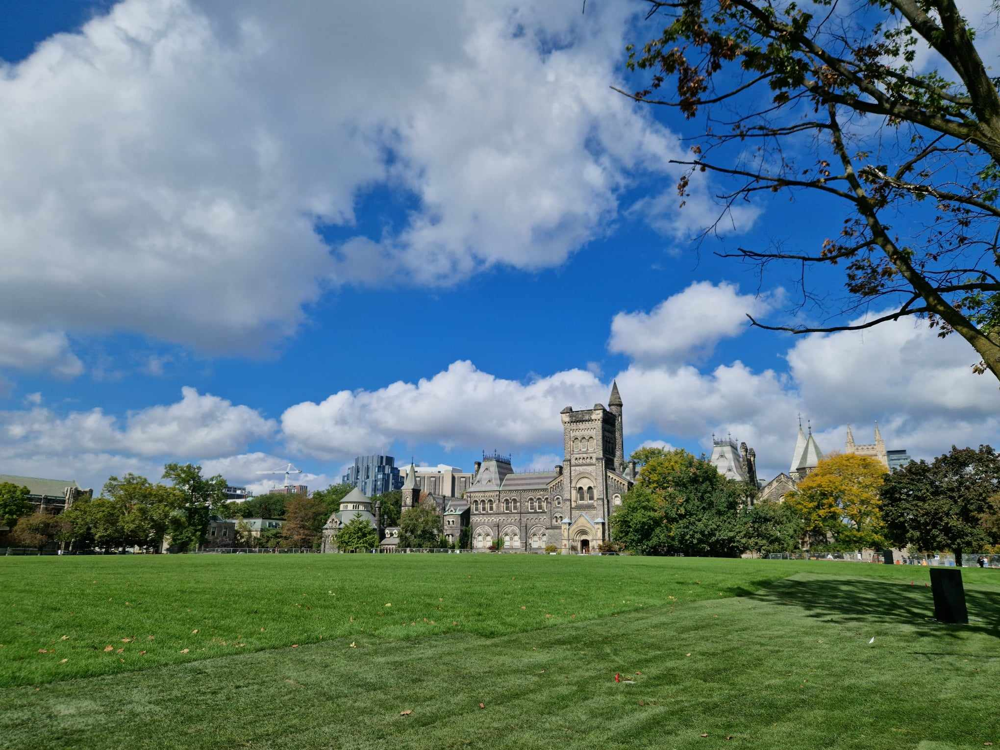
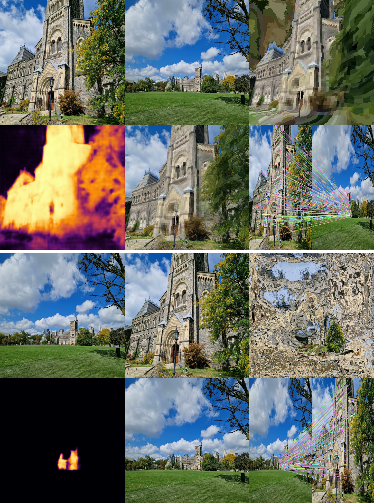
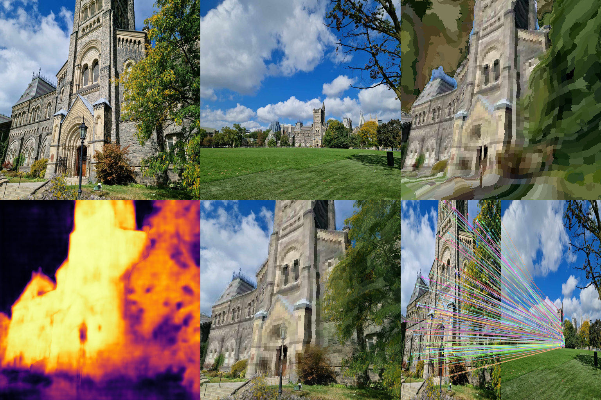

# RoMa v2 — ONNX & Triton Deployment

Export, validate, and serve the [RoMa v2](https://github.com/Parskatt/RoMaV2) dense image matcher as an ONNX model, with full support for local inference and NVIDIA Triton Inference Server deployment.

RoMa v2 produces a **dense warp** and **overlap confidence map** between any two images — useful for visual localization, 3D reconstruction, and image alignment.

---

## Example results

Input images (University of Toronto, large viewpoint change):

| Image A | Image B |
|---------|---------|
|  |  |

**Matching output** (PyTorch / ONNX / Triton — all identical):


> **Top-left:** Image A · **Top-center:** Image B · **Top-right:** Image B warped into A's frame
> **Bottom-left:** Overlap confidence (bright = high) · **Bottom-center:** Alpha blend · **Bottom-right:** Dense correspondences

---

## Requirements

```bash
git clone https://github.com/ilanmotiei/romav2-onnx
cd romav2-onnx
pip install ".[all]"
```

Or without the Triton client:

```bash
pip install .
```

The modified `romav2` source is embedded directly in `src/` — no separate clone or install step needed. It is a fork of [Parskatt/RoMaV2](https://github.com/Parskatt/RoMaV2) with the following changes required for ONNX export:
- `enable_amp` flag added to `Matcher`, `Refiners`, `FineFeatures`, `DPTHead` and `VGG` so AMP/bfloat16 can be disabled at export time
- `pos_embed_rope_dtype` added to `Matcher.Cfg` and `vit_from_name` to keep RoPE in float32
- `native_torch_local_corr` vectorised (removed Python `for` loop over batch) for dynamic-batch ONNX compatibility
- `@torch.inference_mode()` removed from `RoMaV2.forward` (blocks the JIT tracer)

**For Triton server:**
- Docker with the `nvcr.io/nvidia/tritonserver:23.12-py3` image (≈12 GB)

---

## 1 — Export to ONNX

```bash
# Fast setting (512×512 input, ~350 MB model)
python scripts/export_onnx.py --output romav2_fast.onnx --setting fast

# Fast setting with both A→B and B→A dense outputs
python scripts/export_onnx.py \
    --output romav2_fast_bidir.onnx \
    --setting fast \
    --bidirectional

# Base setting (640×640)
python scripts/export_onnx.py --output romav2_base.onnx --setting base
```

Available settings:

| Setting | Input size | Notes |
|---------|-----------|-------|
| `turbo` | 320×320 | Fastest, least accurate |
| `fast`  | 512×512 | Good balance |
| `base`  | 640×640 | Higher accuracy |

The script:
- Disables AMP / bfloat16 everywhere so the full graph stays in float32 (required for ORT compatibility)
- Forces RoPE embeddings to float32
- Uses the classic TorchScript-based JIT tracer (`dynamo=False`)
- Bakes H/W into the graph; only the batch dimension is dynamic

**Inputs:** `img_A`, `img_B` — `float32 [B, 3, H, W]`, values in `[0, 1]`
**Outputs:** `warp_AB` — `float32 [B, H, W, 2]` (normalised coords in `[-1, 1]`), `overlap_AB` — `float32 [B, H, W, 1]` (probability in `[0, 1]`)

Add `--bidirectional` to also export `warp_BA` and `overlap_BA` with the same shapes. This is slower because the matcher/refiners also compute the B→A direction, but it is useful when downstream sampling or geometry wants both directions.

Add `--include-precision` for models that will feed the Triton sampled ensemble. This also exports `precision_AB` and, with `--bidirectional`, `precision_BA`, matching the precision matrices consumed by RoMaV2's `sample()` flow:

```bash
python scripts/export_onnx.py \
    --output romav2_fast_bidir_precision.onnx \
    --setting fast \
    --bidirectional \
    --include-precision
```

---

## 2 — Validate

Runs both the PyTorch model and the exported ONNX model on identical CPU inputs and asserts their outputs match within tolerance.

```bash
python scripts/export_onnx.py --validate romav2_fast.onnx --setting fast

# Validate a bidirectional export
python scripts/export_onnx.py \
    --validate romav2_fast_bidir.onnx \
    --setting fast \
    --bidirectional
```

Expected output:
```
[1/5] Building PyTorch model on CPU ...       Done in 8.2s
[2/5] Running PyTorch forward pass on CPU ... Done in 7.1s
      pt_warp:    shape=(1, 512, 512, 2), min=-0.9123, max=0.9087
      pt_overlap: shape=(1, 512, 512, 1), min=0.0213, max=0.8315
[3/5] Loading ONNX model from romav2_fast.onnx ... Done in 3.4s
[4/5] Running ONNX inference (CPU) ...        Done in 7.4s
      onnx_warp:    shape=(1, 512, 512, 2), min=-0.9123, max=0.9087
[5/5] Comparing outputs (atol=0.02) ...
Validation passed — PyTorch and ONNX outputs match.
```

> Both passes run on CPU so the comparison is numerically equivalent. MPS vs CPU diverges by ~0.23 in warp coords for a 24-layer ViT; always validate CPU-vs-CPU.

---

## 3 — Visualise (direct ONNX)

```bash
# Uses sample images included in this repo
python scripts/visualize.py --onnx romav2_fast.onnx --out result.png

# Bidirectional ONNX exports are detected automatically and produce both directions
python scripts/visualize.py --onnx romav2_fast_bidir.onnx --out bidir_result.png

# Or PyTorch model
python scripts/visualize.py --out result.png

# Custom images
python scripts/visualize.py \
    --img-a path/to/image_A.jpg \
    --img-b path/to/image_B.jpg \
    --onnx romav2_fast.onnx \
    --out result.png
```

The output is a 6-panel composite (2×3 grid):

| Top-left | Top-center | Top-right |
|----------|------------|-----------|
| Image A | Image B | Image B warped into A |

| Bottom-left | Bottom-center | Bottom-right |
|-------------|---------------|--------------|
| Confidence heatmap | Alpha blend | Dense correspondences |

For bidirectional ONNX exports, the image stacks two 6-panel composites: A→B first, then B→A.



---

## 4 — Triton Inference Server

### 4.1 Set up the model repository

The `triton/model_repository/romav2/config.pbtxt` is already configured. You only need to place the exported ONNX file:

```bash
mkdir -p triton/model_repository/romav2/1
cp romav2_fast.onnx triton/model_repository/romav2/1/model.onnx
```

For a bidirectional export, use the separate config:

```bash
mkdir -p triton/model_repository/romav2_bidirectional/1
cp romav2_fast_bidir.onnx triton/model_repository/romav2_bidirectional/1/model.onnx
```

To avoid returning dense `H×W×...` tensors over the network, use the sampled ensemble. It chains a precision-exported bidirectional ONNX model into `romav2_sampler`, a Triton Python backend implementation of RoMaV2's sampling flow:

```bash
mkdir -p triton/model_repository/romav2_bidirectional_dense/1
cp romav2_fast_bidir_precision.onnx \
  triton/model_repository/romav2_bidirectional_dense/1/model.onnx
```

Then call the user-facing ensemble model `romav2_bidirectional_sampled`, not the dense model. The dense tensors stay inside Triton.

For exact RoMaV2 sampling, the Triton Python sampler uses PyTorch via DLPack and should run as a GPU Python backend instance. The plain Triton `py3` images do not always include PyTorch, so build a torch-enabled Triton image before deploying this model:

```bash
docker build \
  -f triton/Dockerfile.torch-sampler \
  -t romav2-triton-torch-sampler:25.07-py3 \
  triton
```

For the lower-latency path, build the custom C++ backend image and call `romav2_bidirectional_fast_sampled`:

```bash
docker build \
  -f triton/Dockerfile.fast-sampler-backend \
  -t romav2-triton-fast-sampler:25.07-py3 \
  triton
```

`romav2_bidirectional_fast_sampled` keeps the same output tensor interface as `romav2_bidirectional_sampled` and follows RoMa's sampling flow: confidence-weighted expansion, KDE density balancing, and final weighted sampling. It is not bit-for-bit identical to the PyTorch sampler for a fixed seed because the C++ backend uses its own random-number generator, but it preserves the same sampling semantics while avoiding the Python/Torch backend dependency.

On Kubernetes, request a GPU and use the NVIDIA runtime class if your cluster requires it:

```yaml
runtimeClassName: nvidia
resources:
  limits:
    nvidia.com/gpu: 1
```

If you export `turbo` or `base`, update the `img_A`/`img_B` input dimensions in the relevant `config.pbtxt` to `320×320` or `640×640`.

The checked-in bidirectional dense Triton config uses concrete warp and overlap channel dimensions because `nvcr.io/nvidia/tritonserver:25.07-py3` rejects fully dynamic `[ -1, -1, -1, -1 ]` for those ONNX outputs. Precision outputs remain five-dimensional and dynamic to match this export across tested Triton versions.

### 4.2 Start the server

There are two sampled Triton server variants:

| Server variant | User-facing model | Image | Notes |
|---|---|---|---|
| Previous Python/Torch sampler | `romav2_bidirectional_sampled` | `romav2-triton-torch-sampler:25.07-py3` | Uses Triton Python backend plus PyTorch/DLPack. This was the slower path, but keeps PyTorch's sampler implementation. |
| Custom C++ backend sampler | `romav2_bidirectional_fast_sampled` | `romav2-triton-fast-sampler:25.07-py3` | Uses `libtriton_romav2_fast_sampler.so` compiled into the image. This follows RoMa sampling semantics and avoids the Python/Torch backend dependency. |

Both variants use the same model repository layout and require the precision-exported bidirectional ONNX file at:

```text
triton/model_repository/romav2_bidirectional_dense/1/model.onnx
```

#### Previous Python/Torch sampler

```bash
docker run --rm -d \
  --name romav2-triton \
  --gpus all \
  -p 8000:8000 -p 8001:8001 -p 8002:8002 \
  -v $(pwd)/triton/model_repository:/models \
  romav2-triton-torch-sampler:25.07-py3 \
  tritonserver --model-repository=/models
```

Call this server with:

```bash
python scripts/triton_sampled_client.py \
    assets/toronto_A.jpg assets/toronto_B.jpg \
    --url localhost:8000 \
    --model romav2_bidirectional_sampled \
    --num-corresp 5000
```

#### Custom C++ backend sampler

```bash
docker run --rm -d \
  --name romav2-triton \
  --gpus all \
  -p 8000:8000 -p 8001:8001 -p 8002:8002 \
  -v $(pwd)/triton/model_repository:/models \
  romav2-triton-fast-sampler:25.07-py3 \
  tritonserver --model-repository=/models
```

Call this server with:

```bash
python scripts/triton_sampled_client.py \
    assets/toronto_A.jpg assets/toronto_B.jpg \
    --url localhost:8000 \
    --model romav2_bidirectional_fast_sampled \
    --num-corresp 5000
```

For gRPC, expose port `8001` and use `--url localhost:8001` from a gRPC client. Wait until Triton is ready, then verify:

```bash
curl http://localhost:8000/v2/health/ready        # → HTTP 200
curl -X POST http://localhost:8000/v2/repository/index
```

### 4.3 Run inference

```bash
python scripts/triton_client.py \
    assets/toronto_A.jpg assets/toronto_B.jpg \
    --url localhost:8000 \
    --out result.png
```

For the sampled ensemble:

```bash
python scripts/triton_sampled_client.py \
    assets/toronto_A.jpg assets/toronto_B.jpg \
    --url localhost:8000 \
    --model romav2_bidirectional_sampled \
    --num-corresp 5000
```

For the fast custom-backend ensemble:

```bash
python scripts/triton_sampled_client.py \
    assets/toronto_A.jpg assets/toronto_B.jpg \
    --url localhost:8000 \
    --model romav2_bidirectional_fast_sampled \
    --num-corresp 5000
```

The sampled ensemble returns:

```text
sampled_matches      (N, 4)       # x_A, y_A, x_B, y_B in normalized coordinates
sampled_confidence   (N,)
sampled_precision_A  (N, 2, 2)
sampled_precision_B  (N, 2, 2)
```

### 4.4 Run Mega-1500

RoMaV2 reports MegaDepth-1500 / Mega-1500 and ScanNet-1500 pose-estimation
benchmarks. This repo includes a Triton adapter for Mega-1500 so the benchmark
can call the sampled ensemble as if it were a Python RoMaV2 model.

Prepare the MegaDepth benchmark data under:

```text
data/megadepth/
```

At minimum, the Mega-1500 split files must be present:

```text
data/megadepth/0015_0.1_0.3.npz
data/megadepth/0015_0.3_0.5.npz
data/megadepth/0022_0.1_0.3.npz
data/megadepth/0022_0.3_0.5.npz
data/megadepth/0022_0.5_0.7.npz
```

Check the data layout without running inference:

```bash
python scripts/benchmark_triton_mega1500.py --check-data
```

Run the full benchmark against the fast sampled ensemble:

```bash
python scripts/benchmark_triton_mega1500.py \
    --data-root data/megadepth \
    --url localhost:8000 \
    --model romav2_bidirectional_fast_sampled
```

For gRPC, use the gRPC port and protocol:

```bash
python scripts/benchmark_triton_mega1500.py \
    --data-root data/megadepth \
    --url localhost:8001 \
    --protocol grpc \
    --model romav2_bidirectional_fast_sampled
```

For fast qualitative checks, run a deterministic Mega-1500 subset. This uses
the same pose-estimation metric and all five scene split files, but only the
first `N` pairs from each scene and one stochastic sample per pair:

```bash
python scripts/benchmark_triton_mega1500.py \
    --data-root data/megadepth \
    --url localhost:8001 \
    --protocol grpc \
    --model romav2_bidirectional_fast_sampled \
    --samples-per-pair 1 \
    --max-pairs-per-scene 20
```

The subset score is useful for regressions and sanity checks, but it is not the
official Mega-1500 score.

### 4.5 Use the client in Python

```python
from scripts.triton_client import infer

warp_AB, overlap_AB = infer(
    "path/to/image_A.jpg",
    "path/to/image_B.jpg",
    url="localhost:8000",       # or remote host:port
    model_name="romav2",
)
# warp_AB:    numpy (512, 512, 2)  normalised coords in [-1, 1]
# overlap_AB: numpy (512, 512, 1)  probability in [0, 1]
```

**Triton result** (identical to direct ONNX):



---

## Repository structure

```
romav2-onnx/
├── scripts/
│   ├── export_onnx.py        # Export + validate
│   ├── visualize.py          # 6-panel visualisation (ONNX or PyTorch)
│   ├── triton_client.py      # Triton HTTP client + visualisation
│   └── triton_sampled_client.py
├── triton/
│   └── model_repository/
│       ├── romav2/
│           ├── config.pbtxt  # Triton model config
│           └── 1/            # Place model.onnx here (gitignored)
│       ├── romav2_bidirectional/
│           ├── config.pbtxt  # Triton config for --bidirectional exports
│           └── 1/            # Place bidirectional model.onnx here (gitignored)
│       ├── romav2_bidirectional_dense/
│       │   ├── config.pbtxt  # Internal dense ONNX model for the sampled ensemble
│       │   └── 1/            # Place precision-exported bidirectional model.onnx here
│       ├── romav2_sampler/
│       │   ├── config.pbtxt  # Triton Python backend sampler, GPU torch/DLPack path
│       │   └── 1/
│       ├── romav2_fast_sampler/
│       │   ├── config.pbtxt  # Triton custom C++ backend fast sampler
│       │   └── 1/
│       ├── romav2_bidirectional_sampled/
│           ├── config.pbtxt  # User-facing ensemble returning sparse samples
│           └── 1/            # Empty version directory required by Triton
│       └── romav2_bidirectional_fast_sampled/
│           ├── config.pbtxt  # User-facing ensemble using the C++ fast sampler
│           └── 1/
├── triton/backends/
│   └── romav2_fast_sampler/  # Source for libtriton_romav2_fast_sampler.so
└── assets/
    ├── toronto_A.jpg          # Sample input A
    ├── toronto_B.jpg          # Sample input B
    ├── match_result.png       # Sample ONNX output
    └── triton_result.png      # Sample Triton output
```

---

## Notes

- **Float32 only** — all AMP/bfloat16 paths are disabled at export time; the full graph runs in float32 for ORT compatibility.
- **Static H/W** — height and width are baked into the ONNX graph per setting. Export a separate `.onnx` per setting if you need multiple resolutions.
- **Batch dimension** — the Triton config uses `max_batch_size: 0` with an explicit batch dim in `dims`, matching the ONNX model's fully-dynamic shape annotation. Pass batches of size ≥ 1 from your client.
- **GPU** — dense ONNX inference can run on CUDA with `KIND_GPU`. The exact sampled ensemble also needs a torch-enabled Triton image so `romav2_sampler` can consume DLPack tensors and run sampling on CUDA instead of copying dense tensors back to CPU. The fast sampled ensemble needs the custom backend image built from `triton/Dockerfile.fast-sampler-backend`.
